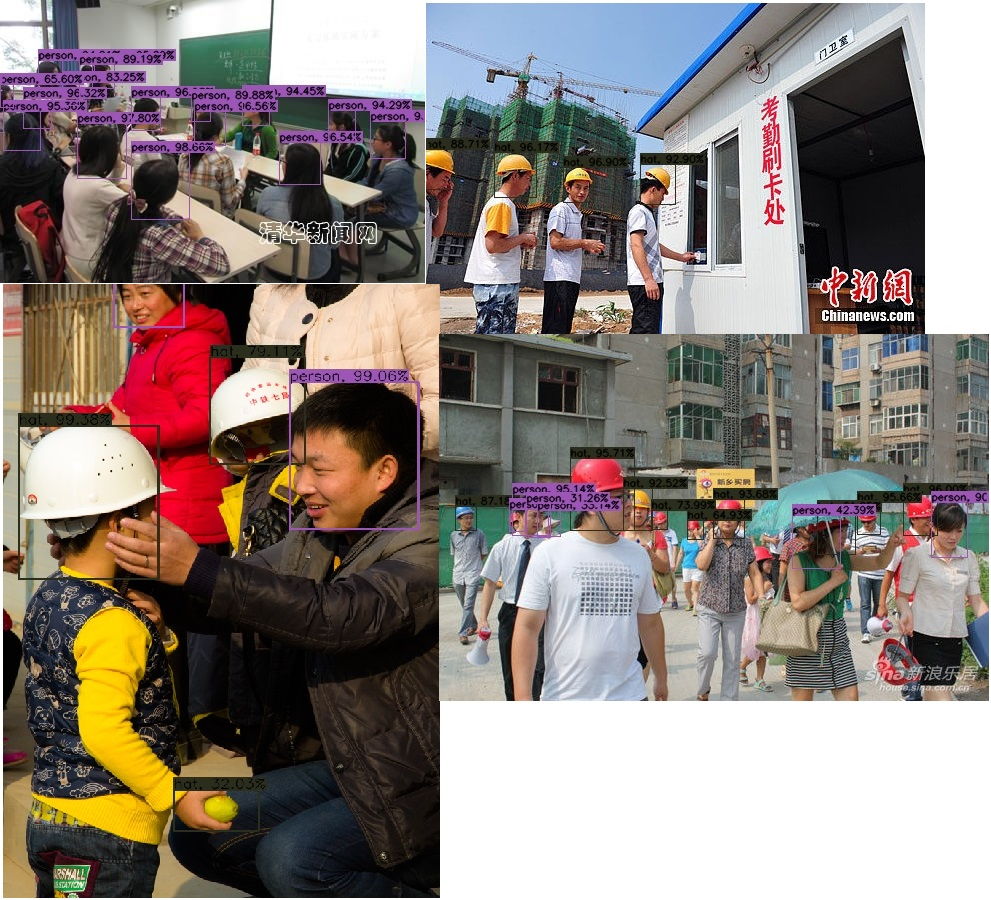
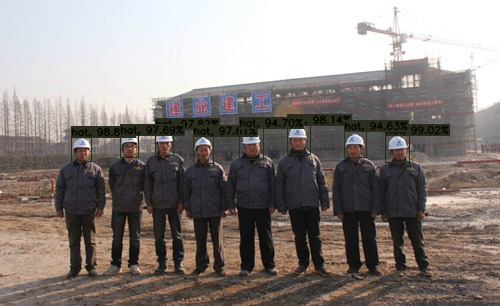

## Tensorflow 实现YOLO V3检测安全帽佩戴

**Xu Jing**

最近几年深度学习的发展让很多计算机视觉任务落地成为可能，这些任务渗透到了各行各业，比如工业安全，包含的任务如安全帽佩戴检测、高空坠物检测、异常事故检测（行人跌倒不起等），火灾检测等等，我们使用YOLO V3训练了一个安全帽佩戴检测的模型。


### 1. 📣 数据介绍

确定了业务场景之后，需要收集大量的数据（之前参加过一个安全帽识别检测的比赛，但是数据在比赛平台无法下载为己用），一般来说包含两大来源，一部分是网络数据，可以通过百度、Google图片爬虫拿到，另一部分是用户场景的视频录像，后一部分相对来说数据量更大，但出于商业因素几乎不会开放。本项目使用开源的安全帽检测数据集([SafetyHelmetWearing-Dataset, SHWD](https://github.com/njvisionpower/Safety-Helmet-Wearing-Dataset))主要通过爬虫拿到，总共有7581张图像，包含9044个佩戴安全帽的bounding box（正类），以及111514个未佩戴安全帽的bounding box(负类)，所有的图像用labelimg标注出目标区域及类别。其中每个bounding box的标签：“hat”表示佩戴安全帽，“person”表示普通未佩戴的行人头部区域的bounding box。另外本数据集中person标签的数据大多数来源于[SCUT-HEAD](https://github.com/HCIILAB/SCUT-HEAD-Dataset-Release)数据集，用于判断是未佩戴安全帽的人。大致说一下数据集构造的过程：

1.数据爬取

用的爬百度图片和Google图片的方法，百度图片用自己写的访问web页面的方式，通过不同的关键词多线程爬取数据，如果是Google图的话推荐用google-images-download，使用方法不多描述，也是爬取多个不同的关键词。关键词是个很有意思的选项，直接用“安全帽”这样的并不是一个好的选择，更多的时候可以用“建筑工人”等之类的词语；英文注意安全帽既可以是“safety Helmet”也可以是“safety hat”，“hard hat”等等。

2.数据清洗

显然用以上爬取得到的图片包含大量重复的，或者是并不包含ROI的图片，需要过滤掉大量的这些图片，这里介绍自己用到的几个方法：

(1)用已有的行人检测方法过滤掉大部分非ROI图像；

(2)可以使用深度学习模型zoo，比如ImageNet分类预训练好的模型提取特征，判断图像相似度，去除极为相似的图像；

(3)剩余的部分存在重名或者文件大小一致的图像，通常情况下这些都是不同链接下的相同图片，在数量少的情况下可以手动清洗。

3.bounding box标注

用的开源标注工具labelImg，这个没什么多说的，是个体力活，不过一个更为省力的方法是**数据回灌**，也就是先用标注好的一部分数据训练出一个粗糙的检测模型，精度虽然不高，不过可以拿来定位出大致的目标区域位置，然后进行手动调整bounding box位置，这样省时省力，反复这样可以减少工期。另外标注的过程中会出不少问题比如由于手抖出现图中小圈的情形,这种情况会导致标注的xml出现bounding box的四个坐标宽或高相等，显然不符合常理，所以需要手动写脚本检查和处理有这种或者其他问题的xml的annotation，比如还有的检测算法不需要什么都没标注的背景图像，可以检测有没有这种“空”类别的数据；甚至是笔误敲错了类别的标签；等等这些都需要手动写自动化或半自动化的脚本来做纠错处理，这样的工具在标注时应该经常用到。也可以看出，一旦标注项目形成规模，规范的自动化流程会节省很多资源。


### 2.✨ 模型介绍

我们使用纯Tensorflow实现的[YOLOv3](https://pjreddie.com/media/files/papers/YOLOv3.pdf). 包含了训练和测试自己数据集的全pipeline. 其主要的特点包括:

- 高效的 tf.data pipeline
- 将COCO数据集预训练的模型迁移学习
- 支持GPU版的NMS.
- 训练和测试推断过程全部有代码样例.
- 使用Kmeans自己训练先验的anchor.


Python 版本: 2 or 3

Packages:

- tensorflow >= 1.8.0 (支持tf.data的版本都可以)
- opencv-python
- tqdm

将预训练的darknet的权重下载，官方下载地址：<https://pjreddie.com/media/files/yolov3.weights>,并将该weight文件拷贝到`./data/darknet_weights/`下，因为这是darknet版本的预训练权重，需要转化为Tensorflow可用的版本，运行如下代码可以实现：

```shell
python convert_weight.py
```

这样转化后的Tensorflow checkpoint文件被存放在：`./data/darknet_weights/`目录。你也可以下载已经转化好的模型：[GitHub Release](https://github.com/DataXujing/YOLO-V3-Tensorflow/releases/tag/1.0)


### 3.🔰 训练数据构建

训练集的整体结构同VOC相同，可以参考VOC构建自己的数据集。

(1) annotation文件

运行

```shell
python data_pro.py
```
分割训练集，验证集，测试集并在`./data/my_data/labal`下生成`train.txt/val.txt/test.txt`，对于一张图像对应一行数据，包括`image_index`,`image_absolute_path`, `img_width`, `img_height`,`box_1`,`box_2`,...,`box_n`,每个字段中间是用空格分隔的，其中:

+ `image_index`文本的行号
+ `image_absolute_path` 一定是绝对路径
+ `img_width`, `img_height`,`box_1`,`box_2`,...,`box_n`中涉及数值的取值一定取int型
+ `box_x`的形式为：`label_index, x_min,y_min,x_max,y_max`(注意坐标原点在图像的左上角)
+ `label_index`是label对应的index(取值为[0~class_num-1]),这里要注意YOLO系列的模型训练与SSD不同，label不包含background

例子：

```
0 xxx/xxx/a.jpg 1920,1080,0 453 369 473 391 1 588 245 608 268
1 xxx/xxx/b.jpg 1920,1080,1 466 403 485 422 2 793 300 809 320
...
```

(2) class_names文件:

`coco.names`文件在 `./data/` 路径下，每一行代表一个label name,例如：

```
hat
person
```

(3) 先验anchor文件:

使用Kmeans生成先验anchors:

```
python get_kmeans.py
```


可以得到9个anchors和平均的IOU,把anchors保存在文本文件：`./data/yolo_anchors.txt`, 

**注意: Kmeans计算出的YOLO Anchors是在在调整大小的图像比例的，默认的调整大小方法是保持图像的纵横比。**


### 4.📝 训练

修改`arg.py`中的一些参数，如下：

<details>
<summary><mark><font color=darkred>修改arg.py</font></mark></summary>
<pre><code>
### Some paths
train_file = './data/my_data/label/train.txt'  # The path of the training txt file.
val_file = './data/my_data/label/val.txt'  # The path of the validation txt file.
restore_path = './data/darknet_weights/yolov3.ckpt'  # The path of the weights to restore.
save_dir = './checkpoint/'  # The directory of the weights to save.
log_dir = './data/logs/'  # The directory to store the tensorboard log files.
progress_log_path = './data/progress.log'  # The path to record the training progress.
anchor_path = './data/yolo_anchors.txt'  # The path of the anchor txt file.
class_name_path = './data/coco.names'  # The path of the class names.
### Training releated numbers
batch_size = 32  #6
img_size = [416, 416]  # Images will be resized to `img_size` and fed to the network, size format: [width, height]
letterbox_resize = True  # Whether to use the letterbox resize, i.e., keep the original aspect ratio in the resized image.
total_epoches = 500
train_evaluation_step = 100  # Evaluate on the training batch after some steps.
val_evaluation_epoch = 50  # Evaluate on the whole validation dataset after some epochs. Set to None to evaluate every epoch.
save_epoch = 10  # Save the model after some epochs.
batch_norm_decay = 0.99  # decay in bn ops
weight_decay = 5e-4  # l2 weight decay
global_step = 0  # used when resuming training
### tf.data parameters
num_threads = 10  # Number of threads for image processing used in tf.data pipeline.
prefetech_buffer = 5  # Prefetech_buffer used in tf.data pipeline.
### Learning rate and optimizer
optimizer_name = 'momentum'  # Chosen from [sgd, momentum, adam, rmsprop]
save_optimizer = True  # Whether to save the optimizer parameters into the checkpoint file.
learning_rate_init = 1e-4
lr_type = 'piecewise'  # Chosen from [fixed, exponential, cosine_decay, cosine_decay_restart, piecewise]
lr_decay_epoch = 5  # Epochs after which learning rate decays. Int or float. Used when chosen `exponential` and `cosine_decay_restart` lr_type.
lr_decay_factor = 0.96  # The learning rate decay factor. Used when chosen `exponential` lr_type.
lr_lower_bound = 1e-6  # The minimum learning rate.
# only used in piecewise lr type
pw_boundaries = [30, 50]  # epoch based boundaries
pw_values = [learning_rate_init, 3e-5, 1e-5]
### Load and finetune
# Choose the parts you want to restore the weights. List form.
# restore_include: None, restore_exclude: None  => restore the whole model
# restore_include: None, restore_exclude: scope  => restore the whole model except `scope`
# restore_include: scope1, restore_exclude: scope2  => if scope1 contains scope2, restore scope1 and not restore scope2 (scope1 - scope2)
# choise 1: only restore the darknet body
# restore_include = ['yolov3/darknet53_body']
# restore_exclude = None
# choise 2: restore all layers except the last 3 conv2d layers in 3 scale
restore_include = None
restore_exclude = ['yolov3/yolov3_head/Conv_14', 'yolov3/yolov3_head/Conv_6', 'yolov3/yolov3_head/Conv_22']
# Choose the parts you want to finetune. List form.
# Set to None to train the whole model.
update_part = ['yolov3/yolov3_head']
### other training strategies
multi_scale_train = True  # Whether to apply multi-scale training strategy. Image size varies from [320, 320] to [640, 640] by default.
use_label_smooth = True # Whether to use class label smoothing strategy.
use_focal_loss = True  # Whether to apply focal loss on the conf loss.
use_mix_up = True  # Whether to use mix up data augmentation strategy. 
use_warm_up = True  # whether to use warm up strategy to prevent from gradient exploding.
warm_up_epoch = 3  # Warm up training epoches. Set to a larger value if gradient explodes.
### some constants in validation
# nms
nms_threshold = 0.45  # iou threshold in nms operation
score_threshold = 0.01  # threshold of the probability of the classes in nms operation, i.e. score = pred_confs * pred_probs. set lower for higher recall.
nms_topk = 150  # keep at most nms_topk outputs after nms
# mAP eval
eval_threshold = 0.5  # the iou threshold applied in mAP evaluation
use_voc_07_metric = False  # whether to use voc 2007 evaluation metric, i.e. the 11-point metric
### parse some params
anchors = parse_anchors(anchor_path)
classes = read_class_names(class_name_path)
class_num = len(classes)
train_img_cnt = len(open(train_file, 'r').readlines())
val_img_cnt = len(open(val_file, 'r').readlines())
train_batch_num = int(math.ceil(float(train_img_cnt) / batch_size))
lr_decay_freq = int(train_batch_num * lr_decay_epoch)
pw_boundaries = [float(i) * train_batch_num + global_step for i in pw_boundaries]
</code></pre>
</details>

运行：


```shell
CUDA_VISIBLE_DEVICES=GPU_ID python train.py
```

我们训练的环境为：

+ ubuntu 16.04
+ Tesla V100 32G


### 5.🔖 推断

我们使用`test_single_image.py`和`video_test.py`推断单张图片和视频，测试Demo在`6.⛏Demo`提供。你可以下载我们预训练的安全帽识别模型进行测试，下载地址：[GitHub Release](https://github.com/DataXujing/YOLO-V3-Tensorflow/releases/tag/model)

```
python3 test_single_image.py /home/myuser/xujing/YOLO_V3_hat/data/my_data/JPEGImages/000002.jpg
```

### 6.⛏Demo






### 7.⛏训练的一些Trick

这些Trick来源于：<https://github.com/wizyoung/YOLOv3_TensorFlow>

(1) 使用two-stage训练或one-stage训练:

+ Two-stage training:

    - 第一阶段：在COCO数据集训练的ckeckpoints上加载darknet53_body部分的weights，训练YOLO V3的head部分，使用较大的学习率比如0.001，直到损失降下来；
    - 第二阶段：加载第一阶段训练的模型，训练整个模型的参数，使用较小的学习率比如0.0001。

+ One-stage training:

直接加载除Conv_6,Conv_14和Conv_22(这三层是输出层需要根据自己训练数据调整)的预训练模型，这种情况需要注意Loss的nan问题，对于该项目为了简单，我们采用One-stage training。


(2) args.py中有很多有用的训练参数调整策略:

+ 学习率的decay(Cosine decay of lr (SGDR))

+ 多尺度训练（Multi-scale training）

+ 标签平滑（Label smoothing）

+ 数据增强（Mix up data augmentation）

+ Focal loss（来源于RetinaNet主要修正目标检测中的unblance问题）

这么多策略，不一定都能提升你的模型性能，根据自己的数据集自行调整选择.

(3) 注意：

来自于gluon-cv的这篇[paper](https://arxiv.org/abs/1902.04103) 已经证明对于YOLO V3数据增强是很有必要的, 但是对于我们的实验来看一些数据增强的策略看起来是合理的，但是会导致我们的模型不work,比如，使用随机的色彩抖动数据增强策略，我们的模型的mAP掉的很厉害，所有需要好好研究数据增强的使用策略。

(4) Loss nan? 

出现Loss nan的情况尽量设置大一点的warm_up_epoch的值，或者小一点的学习率，多试几次。如果你使用的是one-stage的训练过程，使用adam优化器可能会出现nan的问题，请选择momentum optimizer
。

### 8.😉 致谢

Name                      |   GitHub                                                       |
:-:                       |  :-:                                                           |
:shipit: **Wizyoung**     |   <https://github.com/wizyoung/YOLOv3_TensorFlow>              |
:shipit: **njvisionpower**     |<https://github.com/njvisionpower/Safety-Helmet-Wearing-Dataset>|
:shipit: **HCIILAB**     | <https://github.com/HCIILAB/SCUT-HEAD-Dataset-Release>         |


